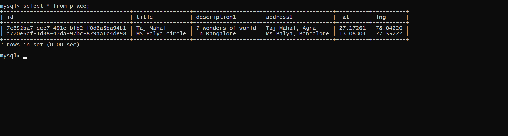

# Places
Adding places and displaying it with the help of Mapbox

<h2>How To Run</h2>
 
Clone the repo 
 
npm install
 
cd client
 
npm install
 
cd ..
 
npm run dev
  

<h2>Things to do before running</h2>
Make sure mysql s running locally and update the username and password respectively in keys.js and in PlaceDB.js  
Create a Database Place and a table with attributes given in the file Queries.js

<h2>Running</h2>
 
Starting page

Adding a place

Displaying it in the route page

Displaying the Location in the map with the help of Mapbox api

Displaying it in the mysql command line

